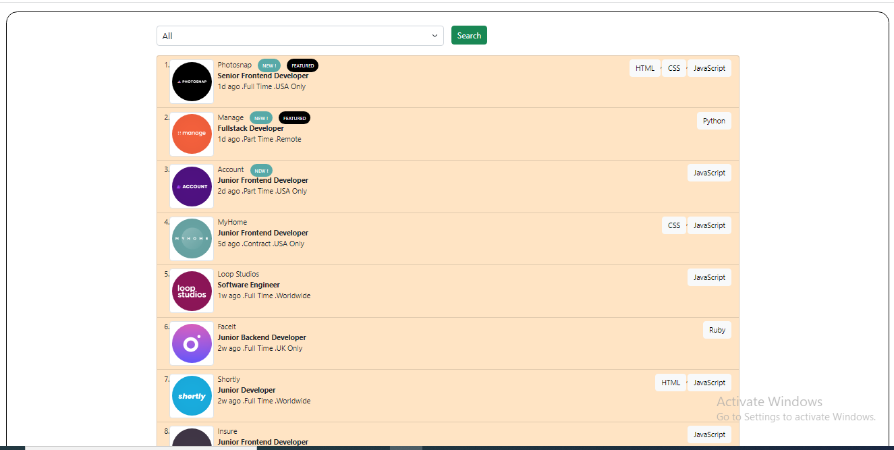

# Job-listings-with-filtering
# Frontend Mentor - Job listings with filtering solution

This is a solution to the [Job listings with filtering challenge on Frontend Mentor](https://www.frontendmentor.io/challenges/job-listings-with-filtering-ivstIPCt).

### The challenge

Users should be able to:
- Filter job listings based on the categories

### Screenshot




### Links
- Live Site URL: job-listing-with-filtering1.netlify.app

## My process

### Built with

- Semantic HTML5 markup
- CSS custom properties
- Flexbox
- Javascript ES6


### What I learned
```js - filter listings


